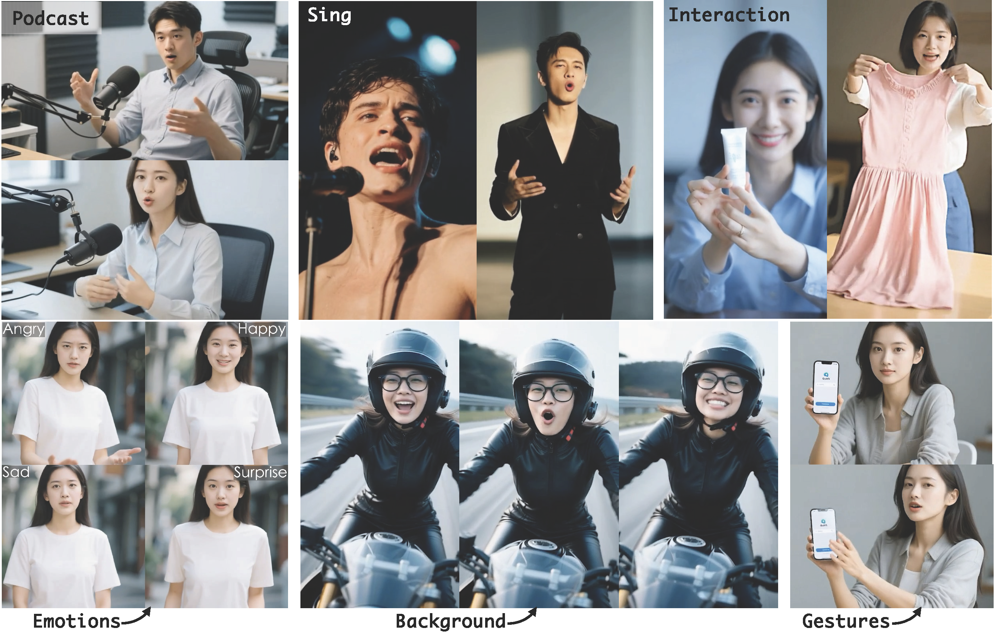

<div align="center">
<h1>OmniAvatar: Efficient Audio-Driven Avatar Video Generation with Adaptive Body Animation</h1>


[Qijun Gan](https://agnjason.github.io/) · [Ruizi Yang](https://github.com/ZiziAmy/) · [Jianke Zhu](https://person.zju.edu.cn/en/jkzhu) · [Shaofei Xue]() · [Steven Hoi](https://scholar.google.com/citations?user=JoLjflYAAAAJ)

Zhejiang University, Alibaba Group

<div align="center">
  <a href="https://omni-avatar.github.io/"></a> &ensp;
  <a href="http://arxiv.org/abs/2506.18866"></a> &ensp;
  <a href="https://huggingface.co/OmniAvatar/OmniAvatar-14B"></a>
</div>
</div>



## 🔥 Latest News!!
* July 2-nd, 2025: We released the model weights for Wan 1.3B!
* June 24-th, 2025: We released the inference code and model weights!


## Quickstart
### 🛠️Installation

Clone the repo:

```
git clone 
cd OmniAvatar
```

Install dependencies:
```
pip install torch==2.4.0 torchvision==0.19.0 torchaudio==2.4.0 --index-url https://download.pytorch.org/whl/cu124
pip install -r requirements.txt
# Optional to install flash_attn to accelerate attention computation
pip install flash_attn
```

### 🧱Model Download
| Models                |                       Download Link                                           |    Notes                      |
|-----------------------|-------------------------------------------------------------------------------|-------------------------------|
| Wan2.1-T2V-14B        |      🤗 [Huggingface](https://huggingface.co/Wan-AI/Wan2.1-T2V-14B)     | Base model for 14B
| OmniAvatar model 14B  |      🤗 [Huggingface](https://huggingface.co/OmniAvatar/OmniAvatar-14B)         | Our LoRA and audio condition weights
| Wan2.1-T2V-1.3B       |      🤗 [Huggingface](https://huggingface.co/Wan-AI/Wan2.1-T2V-1.3B)     | Base model for 1.3B
| OmniAvatar model 1.3B |      🤗 [Huggingface](https://huggingface.co/OmniAvatar/OmniAvatar-1.3B)         | Our LoRA and audio condition weights
| Wav2Vec               |      🤗 [Huggingface](https://huggingface.co/facebook/wav2vec2-base-960h)      | Audio encoder

Download models using huggingface-cli:
``` sh
mkdir pretrained_models
pip install "huggingface_hub[cli]"
huggingface-cli download Wan-AI/Wan2.1-T2V-14B --local-dir ./pretrained_models/Wan2.1-T2V-14B
huggingface-cli download facebook/wav2vec2-base-960h --local-dir ./pretrained_models/wav2vec2-base-960h
huggingface-cli download OmniAvatar/OmniAvatar-14B --local-dir ./pretrained_models/OmniAvatar-14B
```

#### File structure (Samples for 14B)
```shell
OmniAvatar
├── pretrained_models
│   ├── Wan2.1-T2V-14B
│   │   ├── ...
│   ├── OmniAvatar-14B
│   │   ├── config.json
│   │   └── pytorch_model.pt
│   └── wav2vec2-base-960h
│       ├── ...
```

### 🔑 Inference


``` sh
# 480p only for now
# 14B
torchrun --standalone --nproc_per_node=1 scripts/inference.py --config configs/inference.yaml --input_file examples/infer_samples.txt

# 1.3B
torchrun --standalone --nproc_per_node=1 scripts/inference.py --config configs/inference_1.3B.yaml --input_file examples/infer_samples.txt
```

#### 💡Tips
- You can control the character's behavior through the prompt in `examples/infer_samples.txt`, and its format is `[prompt]@@[img_path]@@[audio_path]`. **The recommended range for prompt and audio cfg is [4-6]. You can increase the audio cfg to achieve more consistent lip-sync.** 

- Control prompts guidance and audio guidance respectively, and use `audio_scale=3` to control audio guidance separately. At this time, `guidance_scale` only controls prompts.

- To speed up, the recommanded `num_steps` range is [20-50], more steps bring higher quality. To use multi-gpu inference, just set `sp_size=$GPU_NUM`. To use [TeaCache](https://github.com/ali-vilab/TeaCache), you can set `tea_cache_l1_thresh=0.14` , and the recommanded range is [0.05-0.15]. 
- To reduce GPU memory storage, you can set `use_fsdp=True` and `num_persistent_param_in_dit`. An example command is as follows:
```bash
torchrun --standalone --nproc_per_node=8 scripts/inference.py --config configs/inference.yaml --input_file examples/infer_samples.txt --hp=sp_size=8,max_tokens=30000,guidance_scale=4.5,overlap_frame=13,num_steps=25,use_fsdp=True,tea_cache_l1_thresh=0.14,num_persistent_param_in_dit=7000000000
```

We present a detailed table here. The model is tested on A800.

|`model_size`|`torch_dtype`|`GPU_NUM`|`use_fsdp`|`num_persistent_param_in_dit`|Speed|Required VRAM|
|-|-|-|-|-|-|-|
|14B|torch.bfloat16|1|False|None (unlimited)|16.0s/it|36G|
|14B|torch.bfloat16|1|False|7*10**9 (7B)|19.4s/it|21G|
|14B|torch.bfloat16|1|False|0|22.1s/it|8G|
|14B|torch.bfloat16|4|True|None (unlimited)|4.8s/it|14.3G|

We train train 14B under `30000` tokens for `480p` videos. We found that using more tokens when inference can also have good results. You can try `60000`, `80000`. Overlap `overlap_frame` can be set as `1` or `13`. `13` could have more coherent generation, but error propagation is more severe.

- ❕Prompts are also very important. It is recommended to `[Description of first frame]`- `[Description of human behavior]`-`[Description of background (optional)]`

## 🧩 Community Works
We ❤️ contributions from the open-source community! If your work has improved OmniAvatar, please inform us.
Or you can directly e-mail [ganqijun@zju.edu.cn](mailto:ganqijun@zju.edu.cn). We are happy to reference your project for everyone's convenience. **🥸Have Fun!**

## 🔗Citation
If you find this repository useful, please consider giving a star ⭐ and citation
```
@misc{gan2025omniavatar,
      title={OmniAvatar: Efficient Audio-Driven Avatar Video Generation with Adaptive Body Animation}, 
      author={Qijun Gan and Ruizi Yang and Jianke Zhu and Shaofei Xue and Steven Hoi},
      year={2025},
      eprint={2506.18866},
      archivePrefix={arXiv},
      primaryClass={cs.CV},
      url={https://arxiv.org/abs/2506.18866}, 
}
```

## Acknowledgments
Thanks to [Wan2.1](https://github.com/Wan-Video/Wan2.1), [FantasyTalking](https://github.com/Fantasy-AMAP/fantasy-talking) and [DiffSynth-Studio](https://github.com/modelscope/DiffSynth-Studio) for open-sourcing their models and code, which provided valuable references and support for this project. Their contributions to the open-source community are truly appreciated.
